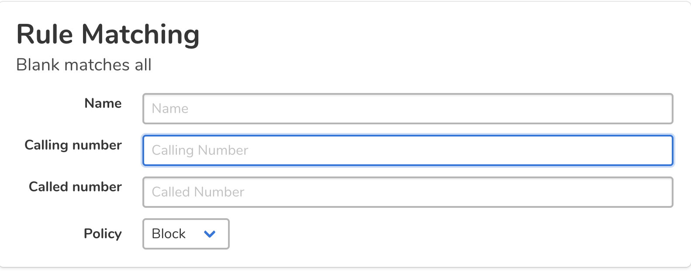
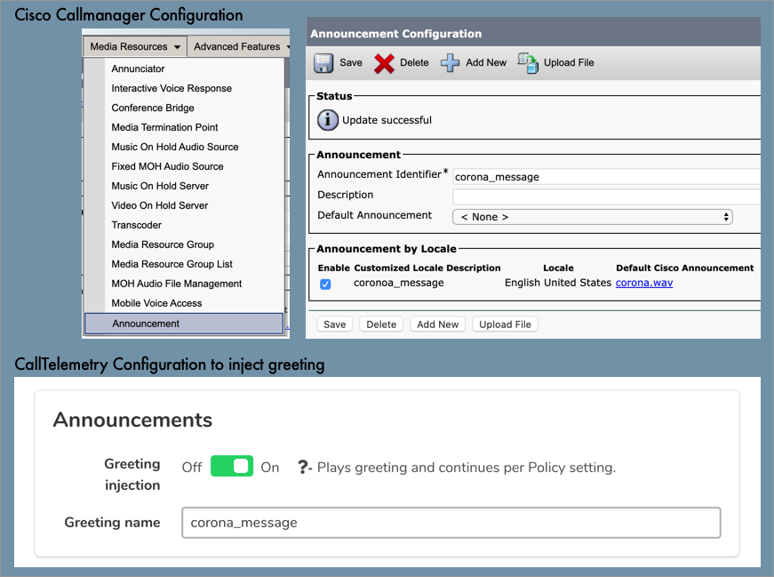
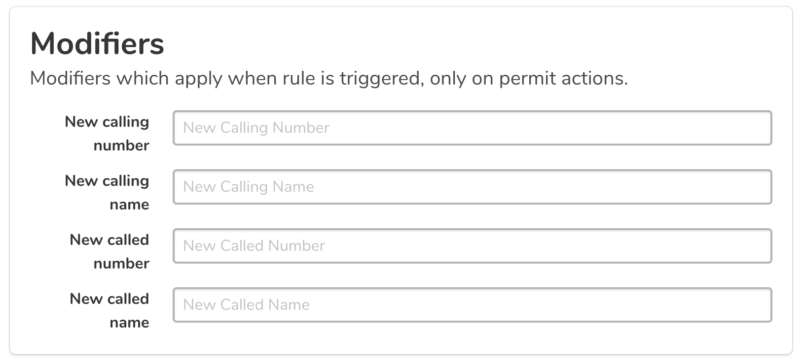

# Rules:

=== "Triggers"
    ### Block or Permit
    
    Starting in 0.4.1, matches support Regex, in addition to simple text.
    
    Rules are in RegEx Format:

    * 911 (matches only 911)
    * .* (match all)
    * ^\d{4}$/ (matches 4 digit calls)
    * ^[1-9]\d{9}$ ( Match 10 digit calls, starting with 1-9)

    You can block or permit the call. If you block, the Caller will hear a fast busy tone, as the call is rejected.
    

=== "Greetings"
    !!! note "Greeting Name and Identifier must match exactly!"
    You can inject a callmanager greeting to any call. Upload audio to Callmanager as an Announcement, and match the exact name to the field in the CallTelemetry Rule.
    

=== "Modifiers"
    You can dynamically change 4 things about the call - the calling and called number, and the calling and called name.
    

=== "Webhooks"
    You can associate WebHooks to a rule to trigger real-time call data to POST to those API servers. You can customize the template sent in the WebHook setup, but not within the rule.
    Pressing + will associate the WebHook to the rule, and Pressing - will remove it from the rule.
    

=== "Apps"
    You can associate Apps to rules to trigger services to react on real-time call data. Pressing '+' will associate the App to the rule. Pressing '-' will remove it from the rule.
    You must create Apps before they will show up on this page.
    